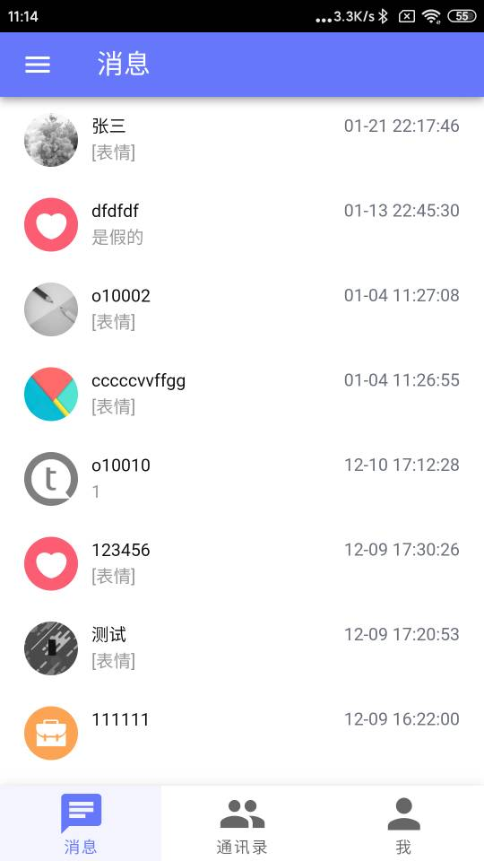
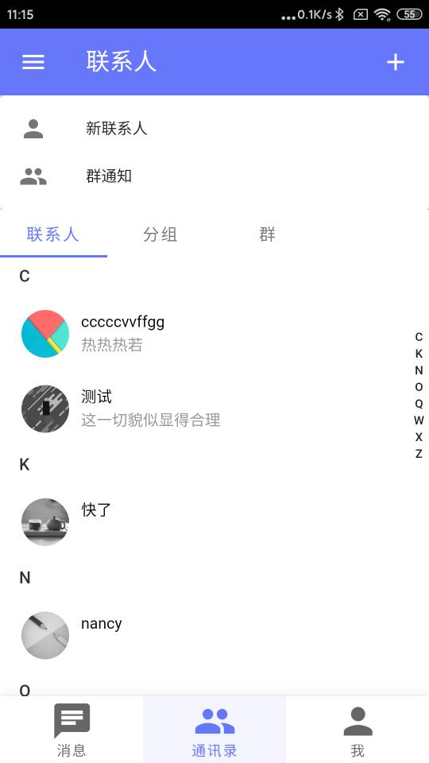
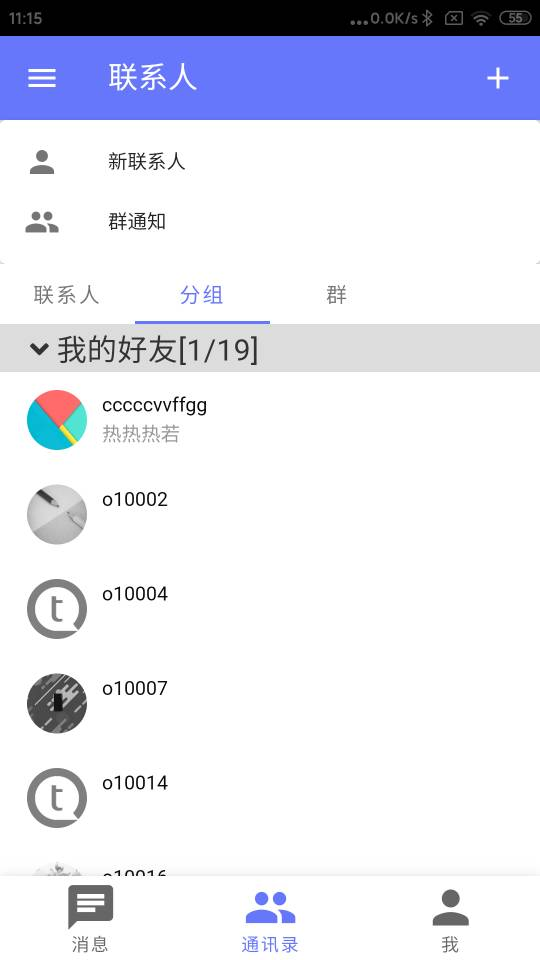
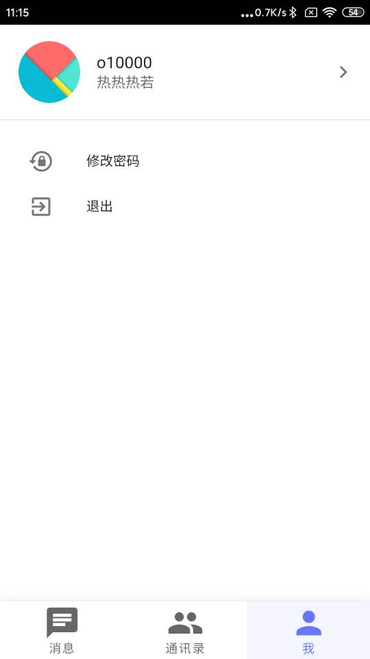
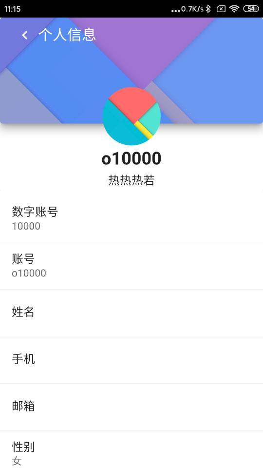

<h1 align="center">OIM-E</h1>

# 简介
OIM移动端，Vue+TS实现，可通过Cordova打包成安卓和ISO；OIM服务端使用Spring Cloud微服务架构，为了方便入门，同时也提供单机版。

## 截图








## 关于服务端
整个完整项目是包含服务端的，所以本项目是需要的服务端支持。服务端是采用Java开发，同样都是开源的。
服务端源码地址：https://gitee.com/oimchat/oim-server

## 环境
nodejs v12.18.3
尽量采用相同版本，避免报错

## 命令

```
初次下载源码后进行安装依赖
npm install

开发调试
npm run dev

打包构建
npm run build
```

